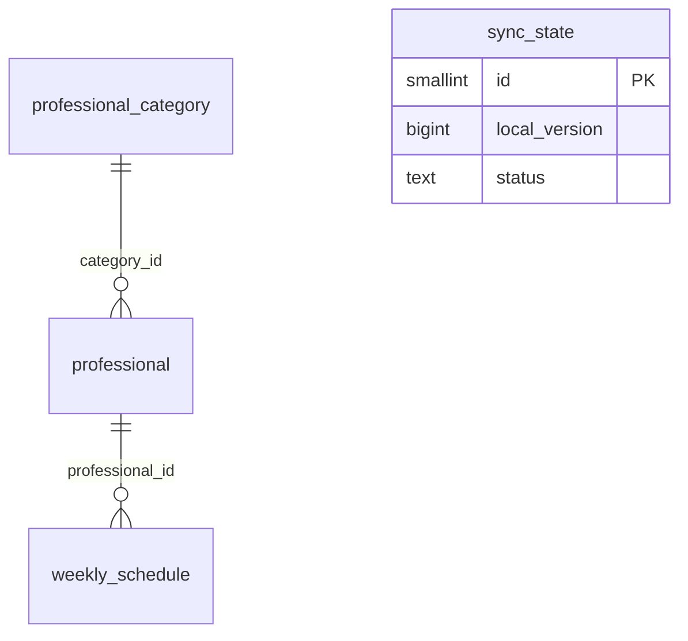

# Modelo de datos de atlas-catalogo

**Estado:** aceptado, con la consulta 2 al docente pendiente · **Componente:** atlas-catalogo · **Contexto:** Isla 1, issue #7 · **Base:** PostgreSQL, migraciones con Flyway ([ADR 0002](../arquitectura/adr/0002-stack.md)) · **Arquitectura:** [ADR 0003](../arquitectura/adr/0003-arquitectura.md)

## Alcance y propiedad

- `atlas-catalogo` es el único propietario de estas tablas. `cronos-turnos` no accede a la base de atlas: consume los datos por contrato (enunciado, sección 3).
- Cada repo tiene su propia instancia de PostgreSQL con base y usuario propios. En esta versión el usuario de atlas es dueño de su base y ejecuta las migraciones; separar un usuario de migración de otro de aplicación queda diferido.
- Las tablas del catálogo son una **réplica de solo lectura** de la cátedra: solo la escribe el proceso de sincronización.

## Requisitos que cubre

| # | Requisito | Dónde se resuelve |
|---|---|---|
| M1 | Guardar categorías, profesionales y horarios con los campos del contrato | Tablas `professional_category`, `professional`, `weekly_schedule` |
| M2 | Versión local coherente con los datos | `sync_state.local_version`, actualizada en la misma transacción que los datos |
| M3 | Bajas lógicas, sin borrado físico | Columna `enabled`; no hay `DELETE` |
| M4 | Candado y estado del sync | Tabla `sync_state` (una fila) |
| M5 | Búsqueda por categoría, nombre, habilitado y disponibilidad | Índices y consultas de la sección "Búsqueda" |
| M6 | *Upserts* idempotentes | Claves primarias con los IDs de la cátedra |
| M7 | Datos y migraciones propios | Esquema `public` de la base de atlas; migraciones `V1__...` en el repo de atlas |
| M8 | Orden de carga por claves foráneas | Categorías → profesionales → horarios |
| M9 | Tipos compatibles con el contrato | Ver "Tipos" |

## Tablas

### `professional_category`

| Columna | Tipo | Notas |
|---|---|---|
| `id` | `bigint` PK | ID de la cátedra (no generado) |
| `name` | `text` NOT NULL | |
| `description` | `text` | Puede ser nulo |
| `enabled` | `boolean` NOT NULL | Baja lógica |
| `created_at` | `timestamptz` NOT NULL | Valor de la cátedra |
| `updated_at` | `timestamptz` NOT NULL | Valor de la cátedra |

### `professional`

| Columna | Tipo | Notas |
|---|---|---|
| `id` | `bigint` PK | ID de la cátedra |
| `category_id` | `bigint` NOT NULL | FK → `professional_category(id)` |
| `first_name` | `text` NOT NULL | |
| `last_name` | `text` NOT NULL | |
| `enabled` | `boolean` NOT NULL | Baja lógica |
| `created_at` | `timestamptz` NOT NULL | Valor de la cátedra |
| `updated_at` | `timestamptz` NOT NULL | Valor de la cátedra |

Índice: `professional(category_id)`.

### `weekly_schedule`

| Columna | Tipo | Notas |
|---|---|---|
| `id` | `bigint` PK | ID de la cátedra |
| `professional_id` | `bigint` NOT NULL | FK → `professional(id)` |
| `day_of_week` | `text` NOT NULL | `CHECK` en `MONDAY`…`SUNDAY` |
| `start_time` | `time` NOT NULL | Hora local de atención, sin zona |
| `end_time` | `time` NOT NULL | Hora local de atención, sin zona |
| `slot_duration_minutes` | `integer` NOT NULL | |
| `enabled` | `boolean` NOT NULL | Baja lógica |
| `created_at` | `timestamptz` NOT NULL | Valor de la cátedra |
| `updated_at` | `timestamptz` NOT NULL | Valor de la cátedra |

Índices: `weekly_schedule(professional_id)` y parcial `weekly_schedule(day_of_week, professional_id) WHERE enabled`.

### `sync_state` (una sola fila)

| Columna | Tipo | Notas |
|---|---|---|
| `id` | `smallint` PK | `CHECK (id = 1)`: garantiza una sola fila |
| `local_version` | `bigint` | `NULL` = base vacía |
| `status` | `text` NOT NULL | `IDLE`, `RUNNING` o `ERROR` |
| `last_result` | `text` | `NOOP`, `INCREMENTAL` o `SNAPSHOT` |
| `last_snapshot_reason` | `text` | `BASE_VACIA`, `NO_VERIFICABLE`, `LOCAL_ADELANTADA`, `FUERA_DE_VENTANA` o `FALTA_VERSION` |
| `last_sync_at` | `timestamptz` | Último sync terminado bien |
| `last_error_code` | `text` | Código funcional, sin secretos |
| `last_error_message` | `text` | Mensaje corto, sin secretos ni detalles internos |
| `last_error_at` | `timestamptz` | |
| `updated_at` | `timestamptz` NOT NULL | |

La migración inserta la fila inicial (`id = 1`, `local_version` nulo, `status = 'IDLE'`). La corrida de sync toma la fila con `SELECT ... FOR UPDATE` como candado (ADR 0003) y actualiza `local_version` en la misma transacción que los datos.

## Diagrama



`sync_state` no tiene relaciones: es la única fila de control.

## Tipos

| Dato del contrato | Tipo en PostgreSQL | Tipo en Java |
|---|---|---|
| ID numérico | `bigint` | `Long` |
| Instante ISO-8601 en UTC | `timestamptz` | `Instant` |
| Hora local `HH:mm` o `HH:mm:ss` | `time` | `LocalTime` |
| `dayOfWeek` (`MONDAY`…`SUNDAY`) | `text` con `CHECK` | `java.time.DayOfWeek` (`@Enumerated(STRING)`) |
| `enabled` | `boolean` | `boolean` |

La lectura de `HH:mm` y `HH:mm:ss` se cubre con tests (ADR 0002, D2).

## Reglas de datos

- **Sin borrado físico.** Las bajas llegan como `enabled = false` y se guardan así. Si un registro falta en el snapshot o en el Hash de Redis, se deshabilita localmente (ADR 0003).
- **Escritura en orden:** categorías, profesionales y horarios, para respetar las claves foráneas.
- **Restricciones permisivas.** El contrato no fija longitudes de texto ni garantiza `end_time > start_time` ni franjas sin superposición, por eso solo se imponen `NOT NULL`, las claves foráneas y el dominio de `day_of_week`. Una restricción de más haría fallar y revertir un snapshot válido.
- **Auditoría.** Se conservan `created_at` y `updated_at` de la cátedra. No hay marcas de tiempo locales por fila; la fecha del último sync vive en `sync_state`.

## Búsqueda

Todas las consultas se resuelven con estas tablas, sin consultar a la cátedra.

| Filtro | Cómo se resuelve |
|---|---|
| `categoriaId` | `professional.category_id = :categoriaId` |
| `nombre` | `first_name` o `last_name` con `ILIKE '%:nombre%'`; el catálogo es chico, no se indexa |
| `habilitado` | **Literal:** `professional.enabled = :habilitado` |
| `disponible = true` | **Efectivo:** `professional.enabled` **y** `category.enabled` **y** existe un `weekly_schedule` con `enabled` |
| `diaSemana` (con `disponible`) | Igual que el anterior, y el horario habilitado es de ese `day_of_week` |

```sql
SELECT p.*
FROM professional p
JOIN professional_category c ON c.id = p.category_id
WHERE p.enabled AND c.enabled
  AND EXISTS (SELECT 1 FROM weekly_schedule s
              WHERE s.professional_id = p.id AND s.enabled
                AND (:diaSemana IS NULL OR s.day_of_week = :diaSemana));
```

El detalle de un profesional devuelve todos sus horarios con su propio `enabled`. La paginación y el orden se resuelven en la consulta; el orden por defecto es apellido y nombre.

## Decisiones

Resumen y detalle de cada una. Cada decisión indica por qué se tomó, qué se descartó, qué costo se acepta y cuándo conviene revisarla.

| # | Decisión | Resultado |
|---|---|---|
| A | Alcance de "disponibilidad" | Versión básica: agenda habilitada + día de la semana. Turnos libres reales diferidos. |
| B | Clave primaria | ID de la cátedra |
| C | Estado del sync | Una sola fila |
| D | Registro de `eventId` procesados | No se guarda |
| E | Búsqueda por nombre | `ILIKE` sin índice |
| F | Habilitado | Filtro literal; disponibilidad efectiva |
| G | Restricciones de datos | Permisivas |
| H | Franjas superpuestas | Se aceptan |
| I | Campos derivados | Se calculan en la consulta |
| J | Auditoría local | Solo timestamps de la cátedra y `last_sync_at` |
| K | Usuario de migración distinto del de la aplicación | Diferida |
| L | Ubicación de la migración `V1` | Issue de migraciones y persistencia |

### A — Alcance de "disponibilidad" · Cerrada (versión básica) · consulta 2 pendiente
- **Contexto:** el enunciado (4.1) exige un filtro de disponibilidad resuelto con la copia local, y que `hermes-app` pueda usarlo.
- **Opciones:** (1) profesional con agenda habilitada; (2) además, que atienda un día de la semana dado; (3) que tenga turnos libres reales en una fecha.
- **Decisión:** 1 + 2, con `diaSemana` opcional. La 3 queda diferida.
- **Por qué:** la 3 necesita las ocupaciones, que viven en la cátedra (`GET /api/appointment-occupancies`, por profesional y rango de fechas). atlas no las tiene y el enunciado (6.2) prohíbe consultar al servicio central en cada búsqueda. Además, el cálculo de turnos disponibles es responsabilidad de `cronos-turnos` (enunciado 7). Las opciones 1 y 2 usan solo los horarios semanales locales.
- **Costo aceptado:** un profesional "disponible" puede tener todos sus turnos ocupados; el filtro dice que atiende, no que le quedan turnos.
- **Cuándo revisar:** al responder el docente la consulta 2, y al conectar atlas con cronos.

### B — Clave primaria: ID de la cátedra · Cerrada
- **Alternativa:** clave propia generada, con el ID de la cátedra como columna única.
- **Por qué:** los IDs son estables y únicos por contrato; permite `INSERT ... ON CONFLICT (id)` directo, que hace idempotente el *upsert* (ADR 0003); y `cronos-turnos` identifica profesionales por ese mismo ID al pedir ocupaciones y holds, así que no hace falta traducir.
- **Costo aceptado:** se asume que la cátedra no reutiliza IDs de entidades dadas de baja. El contrato habla de bajas lógicas, lo que lo respalda.
- **Cuándo revisar:** si la cátedra cambiara la política de IDs.

### C — Estado del sync: una sola fila · Cerrada
- **Alternativa:** una fila más una tabla `sync_run` con una fila por corrida.
- **Por qué:** lo necesario es un candado (`SELECT ... FOR UPDATE`, ADR 0003) y el último estado para el endpoint de estado. Un historial es información útil pero no requerida, y agregarlo después es una migración aditiva.
- **Costo aceptado:** sin historial, las evidencias de recuperación (issue 14) dependen de logs y pruebas, no de la base.
- **Cuándo revisar:** al diseñar el issue de estado y manejo de errores, y al preparar las evidencias.

### D — Sin registro de `eventId` procesados · Cerrada
- **Alternativa:** tabla de eventos procesados para deduplicar (la referencia 16 menciona "deduplicar eventId").
- **Por qué:** en el ADR 0003 el evento es solo un disparador. El planificador compara la versión local con la de Redis, así que un evento repetido, retrasado o perdido da el mismo resultado (`Noop`, incremental o snapshot). Se obtiene la idempotencia que pide el enunciado sin tabla extra.
- **Costo aceptado:** no queda registro de qué eventos llegaron; el diagnóstico depende de los logs. En la defensa hay que explicar que la deduplicación se logra por comparación de versiones.
- **Cuándo revisar:** si se necesitara auditar notificaciones.

### E — Búsqueda por nombre: `ILIKE` sin índice · Cerrada
- **Alternativas:** `pg_trgm` (índice de trigramas) y `unaccent` (ignorar tildes).
- **Por qué:** `ILIKE '%texto%'` no usa un índice común, pero el catálogo es chico y una lectura completa es barata. Evita extensiones y migraciones de más.
- **Costo aceptado:** no ignora tildes ("Gomez" no encuentra "Gómez") y no escala a cientos de miles de filas.
- **Cuándo revisar:** si la búsqueda se nota lenta o si los usuarios necesitan ignorar tildes; ambas son migraciones aditivas.

### F — Habilitado: filtro literal, disponibilidad efectiva · Cerrada
- **Alternativas:** efectivo en ambos, o literal en ambos.
- **Por qué:** el enunciado pide filtrar por "estado habilitado" y lo más predecible es que refleje la bandera del profesional tal como la cátedra la informa. La disponibilidad, en cambio, debe ofrecer solo lo que se puede atender: profesional, categoría y horario habilitados.
- **Costo aceptado:** un profesional habilitado en una categoría deshabilitada aparece con `habilitado=true` pero no como disponible. Hay que documentarlo en la API.
- **Cuándo revisar:** si la cátedra aclara cómo trata las categorías deshabilitadas.

### G — Restricciones de datos permisivas · Cerrada
- **Alternativas:** estrictas (`CHECK end_time > start_time`, `slot_duration_minutes > 0`), o permisivas con advertencia en log.
- **Por qué:** el contrato no fija longitudes ni garantiza esas relaciones. Un `CHECK` de más haría fallar y revertir un snapshot válido de la cátedra, y la copia local no podría iniciarse.
- **Costo aceptado:** la base acepta datos raros (por ejemplo un horario con fin anterior al inicio). La validación queda del lado de quien consume, como `cronos-turnos`.
- **Cuándo revisar:** cuando haya un snapshot real que muestre qué datos llegan.

### H — Franjas superpuestas del mismo día · Cerrada
- **Alternativa:** impedirlas con una restricción de exclusión.
- **Por qué:** el contrato no las prohíbe y la copia debe reflejar a la cátedra, no corregirla.
- **Costo aceptado:** quien calcule turnos tiene que tolerar solapamientos (por ejemplo no duplicar un slot).
- **Cuándo revisar:** al definir el contrato entre atlas y cronos; es un punto a tener en cuenta ahí.

### I — Campos derivados calculados en la consulta · Cerrada
- **Alternativa:** columnas desnormalizadas como nombre completo o "tiene agenda".
- **Por qué:** una columna derivada puede desactualizarse y exige mantenerla en cada *upsert*. El catálogo es chico y la consulta con `EXISTS` es barata.
- **Costo aceptado:** consultas algo más largas.
- **Cuándo revisar:** si la búsqueda se vuelve lenta.

### J — Auditoría local mínima · Cerrada
- **Alternativa:** marcas de tiempo locales por fila (cuándo se sincronizó cada una).
- **Por qué:** se conservan `created_at` y `updated_at` de la cátedra, que ya dicen cuándo cambió cada dato. La fecha del último sync vive en `sync_state`. No hace falta más para el alcance de esta isla.
- **Costo aceptado:** no se sabe cuándo se aplicó localmente cada fila.
- **Cuándo revisar:** si se necesitara trazabilidad fina.

### K — Usuario de migración distinto del de la aplicación · Diferida
- **Alternativa:** dos usuarios, uno con permisos de DDL para Flyway y otro con permisos de DML para la aplicación.
- **Por qué se difiere:** el enunciado exige que no haya permisos cruzados entre las bases de atlas y de cronos, y eso se cumple con instancias separadas. Dividir además migración y aplicación mejora la seguridad pero suma configuración al compose y al esqueleto, sin ser requisito de esta isla.
- **Costo aceptado:** la aplicación corre con permisos de dueño de su base.
- **Cuándo revisar:** en la isla de seguridad y documentación final.

### L — La migración `V1` va en el issue de migraciones y persistencia · Cerrada
- **Alternativa:** que el esqueleto ya incluya la `V1`.
- **Por qué:** cada issue tiene una responsabilidad clara. El esqueleto deja la aplicación arrancando con Flyway configurado; el issue de migraciones crea el esquema, las entidades, los repositorios y los tests contra PostgreSQL real. Evita que dos issues compitan por el mismo trabajo.
- **Costo aceptado:** el test de arranque del esqueleto no valida el esquema; eso lo cubre el test de persistencia.
- **Cuándo revisar:** si al implementar el esqueleto resulta artificial dejarlo sin tablas.

## Supuestos y puntos a mejorar

Este documento es un boceto y se puede mejorar en estos puntos:

- Los tipos y longitudes se confirman con un snapshot real; hoy se basan en los ejemplos del contrato.
- La lectura de `oldest-available-version` (consulta 10) afecta al planificador, no al modelo, pero conviene revisar los motivos de snapshot guardados en `last_snapshot_reason`.
- La consulta 2 al docente puede cambiar el alcance del filtro de disponibilidad (decisión A).
- Los casos de franjas superpuestas (H) y de categorías deshabilitadas (F) deben reflejarse en el contrato entre atlas y cronos.
- Falta decidir si el endpoint de estado necesita más campos (issue de estado y manejo de errores).

## Consecuencias

- La migración `V1` sale directamente de este documento y la crea el issue de migraciones y persistencia. El esqueleto deja Flyway configurado y arranca sin tablas.
- El filtro de disponibilidad queda como subconjunto de lo que pide el enunciado; si el docente pide turnos libres reales, se resuelve al conectar los repos.
- Agregar el historial de corridas o `pg_trgm` más adelante no rompe nada: son migraciones aditivas.
